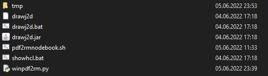

# winpdf2rm

winpdf2rm is a script for converting pdf files int .rm files with
the help of drawj2d (On windows). 

> **I'm an electrical engineering student and not a skilled programmer (especially in accordance to python), the program could have bugs etc.
Therefore I am not liable for any damage. Nevertheless it's runnig without problems on my computer**


## Requirements
-Windows \
-Python \
-PyPDF2 \
-Drawj2d

## Installation
1.Install [Python](https://www.python.org/downloads/) 

2.Install PyPDF2 
```bash
pip install PyPDF2
```
\
3. Download script.py and tmp.zip from my repository.\
4. Download [Drawj2d](https://sourceforge.net/projects/drawj2d/files/) \
5. Put `script.py` into Drawj2d/ directory  (Alternative you can create your own directory and just put drawj2d into it)\
6. Extract zip and put `tmp/` also to Drawj2d/


<p align="left">
  
</p>

## Usage
1. Put one ore multiple PDF files into Drawj2d/ 
2. After executing `script.py` every file that ends with *.pdf gets converted to a zip file. (This can take some time dependent on the pdf size) 

## Contributing
Pull requests are welcome.
